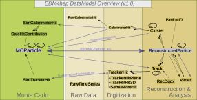

# Sim - FCC-ee
<!-- source /cvmfs/sw.hsf.org/key4hep/setup.sh -->

In this part of the tutorial you will learn how to use the common `Key4hep` tools for fast, parametrized detector simulation with `Delphes`. You can find links pointing to further, more in-depth documentation on these tools in the [resources and further reading section](#resources-and-further-reading) at the bottom of this page.

We will use the IDEA detector concept and run on the $e^+e^- \to ZH \to \mu^+\mu^- b\bar{b}$ production events at FCC-ee that you learned how to generate in the previous step. The simulation takes the showered, generator-level events you produced as input, and outputs the corresponding reconstruction-level events — both in `EDM4hep` format. Along the way, you will get an overview of how the parametrized detector response simulation works, as well as of the `EDM4hep` event data model.

## Running the Delphes fast simulation with Gaudi

Check if you have setup the software stack and the `k4run` executable is available, by running `which k4run`. If this doesn't return a path like `/cvmfs/sw.hsf.org/key4hep/<somewhere>/k4run` please follow [the instructions for setting up again](https://github.com/HEP-FCC/GenToAna-Tutorial/tree/main/Gen/ee#environment-setup).

We will again be using the `Gaudi` approach you learned in the previous part of the tutorial, so we need a steering file to tell it that we want to run Delphes and with which settings. 

A skeleton of such a steering file is provided in `delphes_mumuH_IDEA.py`. You can already take a look into it and try to understand which information we need to fill in in order to make this work yourself. Remember you can use `k4run delphes_mumuH_IDEA.py --help` to get a more detailed description of the config parameters. 

Let us walk-through the different parameters we have to set in the steering file. 

For the input section we have:
- `podioevent.input` sets the path of the input files, so fill in the location of your output file from the previous step here. 
- `inp.collections` defines the list of collections we want to read from our input. Given that we have only run generation & showering so far, these are simply the generator level particles written out by `Pythia8`. You can take a look at the content of your produced file with `podio-dump <your_edm4hep_events.root>` to see what collection name you need to fill in here. In addition to the generator-level particles, it's good practice to also include the `EventHeader` collection here. This carries basic per-event bookkeeping (like event and run numbers) through from the generator-level file into your reconstructed output, which can be useful for debugging if needed.

Next, we load and configure the Delphes algorithm we want to run. In particular we use `k4SimDelphes`, this is an implementation of Delphes in the `Key4hep` environment that directly converts the output to `EDM4hep`. If you are interested, you can find more information about it [here](https://key4hep.github.io/key4hep-doc/main/tutorials/k4simdelphes/doc/starterkit/k4SimDelphes/Readme.html). In terms of settings to fill in we have here:
- `delphesalg.DelphesCard` specifies which Delphes card we want to use. A Delphes card is a plain-text `(.tcl)` configuration file that defines a specific detector's parametrized response — its geometry, resolutions, and reconstruction efficiencies. Because that parametrization lives entirely in the card, swapping in a different one lets you simulate a different detector from the same generator-level input easily, which is the real strength of the fast-sim approach. We will use the baseline FCC-ee IDEA detector card. It comes pre-installed with the `Key4hep` software stack, and you can find the main card under: `$DELPHES_DIR/cards/delphes_card_IDEA.tcl`
There are many other cards, for different (future) colliders and detectors in `$DELPHES_DIR/cards/`, which you can also view in your browser on [on github](https://github.com/delphes/delphes/tree/master/cards). 
- `delphesalg.DelphesOutputSettings` here we need to set the path to another config file defining which collections we want to store in our output `EDM4hep` output file and what their names are. You can use the `edm4hep_IDEA.tcl` baseline configuration provided in this directory. 
- `delphesalg.GenParticles.Path` tells Delphes what the collection of generator level particles to send through the detector response simulation is, use the same name here as for the input collection. 

Finally, we define the following for our output: 
- `out.filename` is simply the name of your output file, you can pick it freely but remember to explicitly include the `.root` file format ending.

### Task 1: Run the IDEA fast simulation
> <details open>
> <summary><strong>❓ Question:</strong></summary>
> <br>
> Complete the steering file and run the Delphes fast simulation with the IDEA detector parametrization.
>
> <br>
> 
> <details>
> <summary><strong>✅ Solution :</strong></summary>
>
> ```bash
> k4run solutions/delphes_IDEA_mumuH_baseline.py
> ```
> </details>
> </details>
<br>


You should see `Delphes` starting up and summarizing its setup, for example: 

```
[....] 
** INFO: adding module        TruthVertexFinder        TruthVertexFinder        
** INFO: adding module        ParticlePropagator       ParticlePropagator       
** INFO: adding module        Efficiency               ChargedHadronTrackingEfficiency
** INFO: adding module        Efficiency               ElectronTrackingEfficiency
** INFO: adding module        Efficiency               MuonTrackingEfficiency   
** INFO: adding module        Merger                   TrackMergerPre           
** INFO: adding module        TrackCovariance          TrackSmearing  
[....]          
```

It will then process the 10k events you produced, which will take a few minutes. While it runs, you can read ahead into the next part where we take a step back to understand what we are processing here exactly.

## Understanding the Delphes parametrization 
Next, lets look at the `Delphes` card to see how the fast simulation works. For the FCC-ee IDEA scenario, we are modelling a detector layout of a vertex detector and drift chamber (inner tracking), followed by dual-readout electromagnetic and hadronic calorimeters, as well as a separate muon system embedded in the return yoke, which provides efficient muon identification and rejection of hadronic fakes. Parametrizations in bins of the pseudorapidity &eta; and the transverse momentum pT are used to model the response across the different regions of the detector. Roughly, the fast simulation proceeds in the following main steps:

- We start from all *stable particles*, as in particles that are written out by `Pythia` as outgoing particles, that do not further decay, at generator level. These are named `Delphes/allParticles` within the card and are the direct input to several Delphes modules:
  <!-- NOTE: This module wasn't available in the old-ish release used in this tutorial  -->
  <!-- - The `BeamSpotSmearing` module gives the option to apply a spatial and temporal Gaussian offset to the collision vertices to mimic   the finite size of the beam spot, if this step is not yet done in the generation. With the standard IDEA setup we rely on here, `Pythia` has already taken care of this, so all the values here are set to zero, disabling the additional correction.  --> 
  
  - The `TruthVertexFinder` module reconstructs truth-level vertices by clustering stable particles according to their production point. Beam-spot smearing (giving collision vertices a realistic finite spatial and temporal spread) is not modelled at this stage in the card — with the standard IDEA setup we rely on here, `Pythia` has already taken care of this upstream.

  - Next, we model the path of all particles through the tracking system in the following way:
    - The generator level particles are passed to the `ParticlePropagator` module, which propagates them through the magnetic field of the inner trackers. Neutral particles are propagated in a straight line, while charged particles are deflected on a helicoidal trajectory — in each case the trajectory is modelled up to the point where the particle enters the calorimeter. Here, the magnetic field strength and coverage of the field (= radius of the inner tracker) are user-defined properties, that depend on the detector scenario we want to study. For the neutral particles, we just need this step to determine the position at which they enter the calorimeter, so we can pick them up in the simulation of the calorimeter response and are therefore done with them here. For charged particles, we continue modeling the tracker response.
    - First we apply the `TrackingEfficiency` modules for the different particle types, these contain the probability of the track for a particle to be reconstructed in bins of the transverse momentum and pseudorapidity. This is the reason why we needed to do the above simple propagation through the magnetic field first, because this tells us exactly which bin a given particle is in to determine the tracking efficiency.
    - Next, we perform a more complete modelling of the track, its hits, and its resolution by propagating a covariance matrix through an explicit layer-by-layer detector geometry, using the `TrackCovariance` module, the instance of which is called `TrackSmearing` in the IDEA card. In very simple words, this module walks through the tracking detector layer by layer, and at each one calculates how much extra "blur" is added to our knowledge of the particle's path — building up, layer by layer, an overall picture of how precisely we can know its trajectory. Note that this is still a fast simulation: instead of simulating every physical interaction in detail, it calculates this blurring directly from the detector's intrinsic resolution at each layer.

      <details>
      <summary><strong>More detail: how the covariance matrix propagation works</strong></summary>
      <br>

      - In the `DetectorGeometry` block, you can literally see this layer-by-layer description laid out line by line, with names like `VTXLOW`, `VTXHIGH`, `DCH`, `BSILWRP`, and `MAG` marking out the vertex detector barrels and disks, the 112 drift-chamber sense-wire layers, the silicon wrapper, and the solenoid coil.
      - The information characterising each layer, encoded in each row, contains the position and dimensions of the layer, how much material it represents, and — if it's an active measurement layer — its hit position resolution, i.e. the size of the aforementioned "blur".
      - Given a track's true trajectory through this geometry, the module analytically propagates a full track-parameter covariance matrix $C$ outward through the material stack, accumulating the multiple-scattering contribution from each passive layer and the measurement uncertainty from each active layer as it goes. Concretely, $C$ is obtained from

        $$C^{-1} = A^t S^{-1} A,$$

        where $A$ is the matrix of derivatives of each layer's predicted hit coordinate with respect to the track parameters, and $S$ is the covariance matrix of the measurements themselves:

        $$S_{ij} = \sigma_i^2\,\delta_{ij} + M_{ij}.$$

      - Here $\sigma_i^2$ is simply layer $i$'s hit resolution, while $M_{ij}$ is a correlation term built up from the multiple scattering at every layer crossed before layers $i$ and $j$ — this is where each layer's material budget enters. No random sampling is needed to get $C$ itself; it comes out of this single analytic calculation.
      - The track resolution achieved in this way therefore isn't the result of a hand-tuned function of $\eta$ and $p_T$. It just falls out naturally from the actual detector layout: tracks at small polar angles pass through more material and fewer effective measurement layers, so their resolution degrades in exactly the way it would in the real detector, without needing a separate resolution-vs-$p_T$/$\eta$ formula to mimic that behavior.

      </details>

- Two further measurements needed for particle identification (PID) are modelled next: energy loss from ionization in the drift chamber, via the `ClusterCounting` module, and time-of-flight, via the `TimeOfFlight` module.
  - The cluster counting method relies on counting the primary ionization clusters a charged particle produces when traversing a gaseous detector, such as, in our case, the IDEA drift chamber, in order to infer the particle's mass: the number of observed clusters per unit length, dN/dx, depends on the particle's velocity. Combined with the momentum already obtained from the track fit, we can determine the mass and therefore the particle identity. The `ClusterCounting` module simulates exactly this measurement in the typical Delphes fast simulation fashion. Rather than modelling the underlying physical interactions between the particle and the gas in detail, the module uses pre-computed tables giving the average cluster density as a function of velocity for a chosen gas mixture. It multiplies that average density by the track's path length through the drift chamber volume to get a mean expected cluster count, then draws the actual simulated count from a Poisson distribution around that mean for each track. 
  - A second, complementary measurement providing PID information is the time of flight measurement. Again, together with the momentum, measuring the time it takes a given particle to cover a known distance allows to determine the particle's mass. The `TimeOfFlight` module implements this using the path length and momentum already available from the `TrackCovariance` calculation, together with a timing measurement from the `TimeSmearing` module. Just like a hit position measurement has a finite resolution determined by the detector design and sensor technologies, the time of flight can also only be measured to some finite precision. This is modelled by applying a Gaussian smearing to  the true simulated time, with the width of the Gaussian defined in the card. Computing the mass from the time of flight also requires knowing the particle's production time at the vertex. In the IDEA simulation, this is taken directly from MC truth for charged particles, and set to zero for neutral particles. 

- For simulating the calorimeter response, a segmentation in &eta; and &phi; is given in the `Calorimeter` module, and it is assumed that each particle deposits its energy into one of these segments (then called a tower). This module also specifies which fraction of a particle's energy is deposited in the electromagnetic and hadronic calorimeter. The energy deposits in the electromagnetic and hadronic calorimeters are then smeared independently, following parametrizations in energy and pseudo-rapidity, as defined in the card. You can see the exact form of these parametrizations visualised [here](figures/idea_calo_resolution.png).

- *Particle-flow* objects are then built by merging tracks with the photon and neutral-hadron objects reconstructed by the calorimeter, forming our physics objects. The idea behind particle flow is to use whichever subdetector measures each particle best — tracks for the momenta of charged particles, since tracker resolution is typically far superior to calorimeter resolution, and calorimeter deposits for neutral particles, which leave no track — rather than relying on calorimeter energy alone. This step happens directly inside the `Calorimeter` module, which returns tracks, as well as photon and neutral hadrons candidates. The `EFlowTrackMerger` and `EFlowMerger` modules that follow simply combine everything into a single unified collection again.

- *Identification efficiency* parametrizations model the fact that a real detector doesn't reconstruct every particle perfectly: even within geometric acceptance, some genuine photons, electrons, or muons are missed due to reconstruction and identification inefficiencies. These are defined per particle species — for example in the `PhotonEfficiency` module. For electrons and muons, this efficiency is applied multiplicatively on top of the tracking efficiency already modelled earlier in the chain; for photons, since they are neutral, `PhotonEfficiency` is the only efficiency applied.

- The last block of the card, the `TreeWriter` module, shows you which objects are propagated to Delphes output level. Note that this doesn't mean we will have them in our `.root` file that we created above, as there is still one step in our simulation chain, which is the conversion from `Delphes` output to `EDM4hep` events. 

*Note*: You will see that some modules for jet clustering and modelling flavour tagging efficiencies as well as lepton and photon isolation are run as well. However, these baseline algorithms are not very well optimized and are therefore not used in physics analyses, which typically run their own methods instead. We do not discuss them further here, as they are part of the next section of the tutorial on the physics analysis. 

### Task 2 : Understand the Delphes card
Look through the Delphes card and try to answer the following questions with the help of the guide above: 

> <details open>
> <summary><strong>❓Questions :</strong></summary>
> <br>
> 
> 1. Above which transverse momentum are we reconstructing tracks in the IDEA Delphes scenario?
>
> 2. How many hits are required to accept a track? 
> 
> 3. Which gas mixture does the `ClusterCounting` module assume by default?
>
> 4. What timing resolution is assumed in the time of flight measurement? 
>
> 5. What fraction of their energy do electrons deposit in the ECal? What about neutral Kaons?
> 
> 6. What is the photon identification efficiency, and over what phase space does it apply?
> <details><summary><strong> ✅ Solutions: </strong></summary>
> <br> 
>
> 1. The tracking efficiency for particles with pT > 100 MeV is assumed to reach 100% for charged hadrons, electrons and muons as can be read off from lines 137, 155 and 172 in the respective `TrackingEfficiency` module initialisations.
>
> 2. In the `TrackSmearing` module setup in line 200 a minimum of 6 hits is set.
>
> 3. `GasOption` 0, which corresponds to 90% Helium / 10% Isobutane, cf. l399.
>
> 4. A constant time resolution of 30 ps is set for the `TimeSmearing` of charged particles and the `TimeSmearingNeutrals`, cf. l414 and l564.
>
> 5. Electrons deposit 100% of their energy in the ECal (l519), for neutral Kaons ($K^0_S$, $K^0_L$) it's 30% (l533f).
>
> 6. Photons with energy ≥ 2 GeV are identified with 99% efficiency, both in the barrel region (|η| ≤ 0.88) and in the endcap region (0.88 < |η| ≤ 3.0), cf. l637f.
>
> </details></details>
<br>

## Understanding EDM4hep datamodel collections

To wrap up this part of the tutorial, let's take a look at the `.root` output file we produced. You can open and inspect it as usual — the tree is called `events`. It follows the `EDM4hep` data model, a common event data model convention for future collider experiments — in other words, a shared format for what information is stored per event and how exactly. In detail the format looks like this:



If you are doing analysis, you will mostly be interested in the `ReconstructedParticle` collection, which contains all objects reconstructed from the detector responses such as tracks and calorimeter clusters, with the `ParticleID` collection telling us the (likely) type of particle. You can take a look at some of the raw distributions here already, to convince yourself that you actually wrote out some events — the next part of the tutorial will walk you through a full analysis built on top of these files.

The event data model of `EDM4hep` is given in this [`.yaml` file](https://github.com/key4hep/EDM4hep/blob/v01-00/edm4hep.yaml) (pinned to the version used by our `Key4hep` release, `2026-04-08`). If you look at the block starting at l581, you can see what information we have available on our `ReconstructedParticle`s.
Which `EDM4hep` collections actually get written to our output file, and under what name, is configured separately from the Delphes card itself, in `edm4hep_IDEA.tcl`:

```
module EDM4HepOutput EDM4HepOutput {
add ReconstructedParticleCollections EFlowTrack EFlowPhoton EFlowNeutralHadron
add GenParticleCollections Particle
add JetCollections Jet
add MuonCollections Muon
add ElectronCollections Electron
add PhotonCollections Photon
set RecoParticleCollectionName ReconstructedParticles
set MCRecoAssociationCollectionName MCRecoAssociations
}
```

Can you match each of these collections back to the Delphes branch/module it comes from, using what you found in Task 2? 

You produced an `EDM4hep` file in the previous tutorial on event generation already. How is it different from the one we produced here?

Besides the physics objects, every `EDM4hep` file also carries the above mentioned `EventHeader` collection. This holds per-event metadata rather than physics content: event and run numbers, and event weights (e.g. for parameter or systematic variations). 
When working with data, this field contains crucial information on e.g. the run number, which ties an event to specific detector and calibration conditions, and to data-quality selections. In simulated samples like ours run numbers are less meaningful, though sometimes repurposed to label a sample or parameter point. Event number and event weights are especially useful in MC however. Event weights are what you'd use for reweighting studies or propagating systematic variations, and event numbers can be very helpful for debugging or cross-referencing, for example for studying the overlap of selections between different decay channels feeding into a combined result. 

### Task 3: Extend the EDM4hep output

Since we're looking at $e^+e^- \to ZH \to \mu^+\mu^- b\bar{b}$ events, we expect at least two muons per event from the $Z$ decay. Add a *second* muon collection to the `EDM4hep` output, pointing to the muon candidates *before* the identification-efficiency cut is applied, and compare its per-event multiplicity to the existing `Muon` collection.

> <details><summary><strong>💡 Hint: where to look</strong></summary>
> <br>
> You'll need to touch two files. First, find the module in the Delphes card that selects candidate muons by truth PDG code, before any efficiency requirement is applied, and add a new `TreeWriter` branch pointing to it. Then add that new branch as a second entry under `MuonCollections` in `edm4hep_IDEA.tcl`. Rerun the `k4run` Gaudi step with a new/adapated steering file afterwards to regenerate the new output file. You can use the command line option `-n <number>` to restrict the number of events processed to smaller amount for quicker run time, since this is just a quick test file we will not be needing further. 
> </details>

> <details><summary><strong>💡 Hint: checking the result without plotting</strong></summary>
> <br>
> If you don't want to make a histogram, you can check the per-event collection sizes directly in an interactive ROOT session. Note that `Muon` and your new collection are subset collections — they only store index references into `ReconstructedParticles`, so a direct `.size()` call won't work. Instead, use ROOT's `@` syntax on the index branch, e.g.:
>
> ```
> root [0] TFile *f = TFile::Open("your_output.root");
> root [1] TTree *events = (TTree*)f->Get("events");
> root [2] events->Scan("Muon_objIdx@.size():MuonRaw_objIdx@.size()")
> ```
> This prints both counts side by side, event by event.
> </details>

> <details><summary><strong>✅ Solution</strong></summary>
> <br>
>
> `k4run solutions/delphes_IDEA_mumuH_allMuons.py -n 10`
>
> The pre-efficiency filter selects muon candidates purely by MC truth PDG code, with no efficiency cut applied. The default `Muon` collection then reflects the identification efficiency parametrization we discussed above. Comparing the two collection sizes gives you a direct, visible measurement of that efficiency — since we expect at least two true muons per event here, you should be able to see the ~99%-efficiency-above-threshold logic show up as occasional events where `MuonRaw` has more entries than `Muon`. 
> </details>

<!-- ADVANCED TASK OPTION ### Task 3 : Changing the PID settings 
CHANGE THE TIMING RESOLUTION, REPRODUCE THE FILE, AND USE BOTH IN THE ANA STEP TO PLOT MTOF  -->


